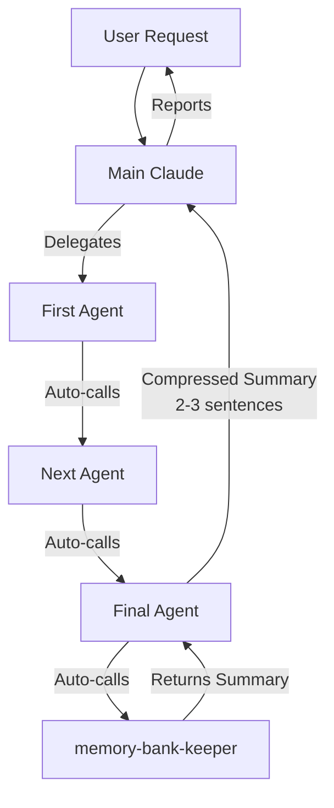

# System Patterns

## System Architecture

### Overall Structure
```
┌─────────────────────────────────────────────────┐
│                   Frontend                       │
│              (React + TypeScript)                │
├─────────────────────────────────────────────────┤
│                Platform Adapter                  │
│         (ElectronAdapter / WebAdapter)           │
├─────────────────────────────────────────────────┤
│                 Express API                      │
│              (Shared Backend Code)               │
├─────────────────────────────────────────────────┤
│              Storage Abstraction                 │
│     SQLite (Electron) / PostgreSQL (Cloud)       │
│          StorageAdapter Interface                │
└─────────────────────────────────────────────────┘
```

### Plugin Architecture (Simplified)
```
┌─────────────────────────────────────┐
│          AppShell                    │
│    (Minimal layout with regions)     │
├─────────────────────────────────────┤
│        Plugin Manager                │
│  (Singleton, handles everything)     │
│  - Storage (components, services)    │
│  - Plugin loading & dependencies     │
│  - Navigation & regions              │
│  - Event bus                         │
├─────────────────────────────────────┤
│         Plugin Host                  │
│    (Dynamic component rendering)     │
└─────────────────────────────────────┘
```

### AppShell Architecture
```
AppShell (minimal stage)
├── Header Region
├── Sidebar Region (with navigation)
├── Main Region (routes)
└── Footer Region

Each region can host plugin components
Theme is provided by a plugin, not AppShell
```

## Key Technical Decisions

### 1. Dual Platform Support
- **Decision**: Single codebase for Electron and Web
- **Implementation**: Platform adapters + runtime detection
- **Benefits**: 95% code reuse, consistent behavior

### 2. Plugin System Design
- **Decision**: Everything is a plugin, game-mod style freedom
- **Implementation**: Simple registry-based, no sandboxing
- **Benefits**: Maximum flexibility, easy to understand, powerful

### 3. Storage Architecture
- **Decision**: Abstract storage interface
- **Implementation**: Same API for local (SQLite) and cloud (PostgreSQL)
- **Benefits**: Platform flexibility, easy testing

### 4. Backend Sharing
- **Decision**: Same Express server runs locally and in cloud
- **Implementation**: Storage adapter injection
- **Benefits**: Consistent API, reduced complexity

### 5. Theme System as Plugin
- **Decision**: Themes are plugins, not built into core
- **Implementation**: Theme plugin wraps AppShell, provides CSS variables
- **Benefits**: Themes can be enhanced by other plugins, fully replaceable
- **Pattern**: Base theme provides guaranteed variables, enhancement plugins add more

### 6. Development Mode Compatibility
- **Decision**: Dual experience based on environment detection
- **Implementation**: `import.meta.env.DEV` detection for development-specific features
- **Benefits**: Lovable prototyping access while preserving production UX
- **Pattern**: Non-intrusive development panel visible only in Vite dev mode

## Design Patterns in Use

### Plugin Manager Pattern
```typescript
class PluginManager {
  private components = new Map<string, React.ComponentType>()
  private services = new Map<string, any>()
  private eventBus = new EventBus()
  
  // Direct access to storage, plus business logic
  getComponent(name: string) { return this.components.get(name) }
  setComponent(name: string, component: React.ComponentType) { 
    this.components.set(name, component)
    this.eventBus.emit('component:registered', { name })
  }
}
```
Single manager handles storage, events, and logic.

### Component Namespacing
```typescript
// Components registered with plugin prefix
manager.setComponent('core.documents/DocumentCard', DocumentCard)
manager.setComponent('ai-enhance/DocumentCard', EnhancedCard)

// No collisions, clear ownership
```

### Plugin Enhancement Pattern
```typescript
// Get original, wrap it, replace it
const Original = manager.getComponent('core.documents/DocumentCard')
const Enhanced = (props) => (
  <>
    <AIFeatures {...props} />
    <Original {...props} />
  </>
)
manager.setComponent('core.documents/DocumentCard', Enhanced)
```

### Agent Auto-Chaining Pattern (Claude Code Orchestration)
**Problem**: Main Claude's context fills up to 50% by understanding a problem before even starting work.

**Solution**: Auto-chaining agent workflows where agents call each other directly, not through Main Claude.



**Key Principles**:
1. **Main Claude as Orchestrator**: Discusses with user, delegates to first agent, receives compressed summaries, reports to user
2. **Agents Auto-Chain**: Each agent knows its position and automatically calls the next agent
3. **memory-bank-keeper as Hub**: Terminal node of all chains, enables context sharing without Main Claude
4. **Compressed Summaries**: Agents return 2-3 sentence summaries to Main Claude, full details in activeContext.md
5. **Context Efficiency**: 10x improvement (600 tokens vs 5000+ per task)

**Implementation Workflow Example**:
```
User: "Implement file upload"
  ↓
Main Claude: Reads coreInstructions.md PRE-TASK CHECKLIST
  ↓
Main Claude: Delegates to context-researcher agent
  ↓
context-researcher: Researches existing patterns, file paths
  ↓ (auto-calls)
memory-bank-keeper: Documents research in activeContext.md
  ↓ (returns control)
context-researcher: Returns compressed summary to Main Claude
  → "Found uploadFile() pattern at DocumentsService.ts:342.
     Uses outdated API. Research documented."
  ↓
Main Claude: Gets user approval, delegates to implementation agent
  ↓
implementation: Reads research from activeContext.md, implements code
  ↓ (auto-calls)
code-reviewer: Reviews implementation
  ↓ (auto-calls)
test-runner-validator: Runs tests
  ↓ (auto-calls)
memory-bank-keeper: Documents results in activeContext.md
  ↓ (returns control through chain)
implementation: Returns compressed summary to Main Claude
  → "File upload implemented with validation.
     Tests passing. Ready for commit."
  ↓
Main Claude: Reports to user
```

**Agent Chain Positions**:
- **First Agents** (start chains): context-researcher, root-cause-debugger, security-reviewer
- **Middle Agents** (continue chains): implementation, code-reviewer, test-runner-validator, code-cleanup-refactor
- **Terminal Node** (ends all chains): memory-bank-keeper
- **Decision Points** (don't auto-chain): security-reviewer (Main Claude decides whether to proceed)

**Context Savings**:
- **Without orchestration**: Main Claude reads full outputs (~5000 tokens per task)
- **With orchestration**: Main Claude only reads summaries (~600 tokens per task)
- **Result**: 100x reduction in memory-bank-keeper enables agents to share context via activeContext.md

**Permanent Documentation**:
- `/memory-bank/coreInstructions.md` - PRE-TASK CHECKLIST, never modified during development
- `.claude/agents/*.md` - Each agent knows its chain position and next agent to call
- `memory-bank/activeContext.md` - Shared context repository ("Recent Changes" section)

### Platform Service Pattern
```typescript
const platform = new PlatformService()
const adapter = platform.getAdapter()
// Same API regardless of platform
adapter.showNotification(title, body)
```

## Component Relationships

### Core Dependencies
```
AppShell → PluginManager (singleton)
    ↓                   ↓
Provides regions    Stores components/services
    ↓                   ↓
    ↓              Manages navigation
    ↓                   ↓
    ↓              Provides EventBus
    ↓                   ↓
PluginHost ← Gets components from PluginManager

Theme Plugin → Wraps AppShell → Provides theme context
                             ↓
                    Other plugins access theme

PlatformService → PlatformAdapter → (ElectronAdapter | WebAdapter)
```

### Data Flow
1. User Action → React Component
2. Component → Platform Service
3. Platform Service → Express API (local or remote)
4. Express API → Storage Adapter
5. Storage Adapter → Database/FileSystem
6. Response flows back up the chain

## Critical Implementation Paths

### Plugin Loading Sequence
1. Import plugin modules
2. Sort by dependencies
3. For each plugin:
   - Register components with namespace
   - Register services with namespace
   - Register routes
   - Call onLoad(registry)
4. Build navigation from all plugins
5. Ready for rendering

### Storage Operation Flow
1. Receive request at API endpoint
2. Validate request data
3. Check user permissions
4. Create operation instance
5. Run validation phase
6. Check for conflicts
7. Execute operation
8. Emit success events
9. Return response

### Platform Detection
```typescript
// At startup
const isElectron = window.electronAPI !== undefined
const adapter = isElectron 
  ? new ElectronAdapter() 
  : new WebAdapter()
```

## Security Considerations

### Plugin Trust Model
- No sandboxing - full trust like game mods
- Plugins can modify anything
- Users responsible for what they install
- Version compatibility in manifests

### Future Security (When Needed)
- Plugin signing for marketplace
- Basic permission declarations
- User consent for sensitive operations
- But start simple - no restrictions

## Storage Architecture

### Cloud Storage Flow (Production-Ready)
```
┌─────────────────────────────────────────────────┐
│         Any Frontend Environment                 │
│  (Local Dev / Lovable Preview / Production)     │
└────────────────┬────────────────────────────────┘
                 │
                 │ HTTPS Request
                 │ https://api.chaycards.com/api/storage
                 ▼
┌─────────────────────────────────────────────────┐
│           Cloudflare Tunnel                      │
│  - Zero-config HTTPS                             │
│  - Bypasses firewall/NAT                         │
│  - Production-ready security                     │
└────────────────┬────────────────────────────────┘
                 │
                 │ Tunneled to localhost:7243
                 ▼
┌─────────────────────────────────────────────────┐
│         Express API Server (Port 7243)           │
│  - REST API with JSONB support                   │
│  - CORS configured for all environments          │
│  - Comprehensive logging                         │
└────────────────┬────────────────────────────────┘
                 │
                 │ Storage Operations
                 ▼
┌─────────────────────────────────────────────────┐
│      PostgreSQL Database (Port 5433)             │
│  - JSONB storage with key-value interface        │
│  - Created by Docker Compose                     │
└─────────────────────────────────────────────────┘
```

**Key Benefits**:
- Same URL works everywhere: `https://api.chaycards.com/api/storage`
- No environment-specific configuration needed
- Lovable preview can access local database
- Ready for production deployment (just deploy Express to VPS/Railway)
- HTTPS without certificate management
- Firewall bypass without port forwarding

### StorageAdapter Pattern
```typescript
interface StorageAdapter {
  get(key: string): Promise<any>;
  set(key: string, value: any): Promise<void>;
  delete(key: string): Promise<void>;
  list(): Promise<string[]>;
  has(key: string): Promise<boolean>;
  clear(): Promise<void>;
}
```

### Storage Implementations
- **SQLiteAdapter**: Electron local storage via better-sqlite3
  - Database location: `%APPDATA%\chaycards\storage.db`
  - IPC communication for renderer process access
  - Synchronous better-sqlite3 wrapped in async interface
- **PostgreSQLAdapter**: Cloud storage via Cloudflare Tunnel ✅ **COMPLETE**
  - Hardcoded URL: `https://api.chaycards.com/api/storage`
  - Async by nature (fetch API)
  - Same interface as SQLite
  - Works in local dev, Lovable preview, and production
  - Comprehensive error logging for debugging
  - CORS configured for all frontend environments

### Plugin Storage Pattern
Each plugin owns its own storage namespace:
- **Core Settings**: `core-settings:app-settings`
- **Theme Preference**: `core-theme:preference` (deprecated) / `core-theme:current-theme` (current)
- **All Themes**: `core-theme:all-themes` (single source of truth for all themes)
- **Favorites**: `core-theme:favorites` (array of theme IDs)
- **Demo Data**: `demo-plugin:notes`

**Key Rules**:
1. Always prefix keys with `plugin-id:`
2. Never use localStorage directly (except pre-init fallback)
3. Storage initialized AFTER core-settings, BEFORE other plugins
4. Plugins receive storage via `manager.getStorage()`

### User Plugin Preferences Pattern
**Problem**: Multi-tenant deployment needs per-user plugin filtering.

**Solution**: Store enabled_plugins list in users table (PostgreSQL/SQLite).

```typescript
// Database schema
interface User {
  id: string;
  email: string;
  installed_plugins: string[]; // ALL plugins discovered by system
  enabled_plugins: string[];   // Plugins user has enabled
  storageMode: 'local' | 'cloud' | 'sync'; // Per-user storage choice
}

// PluginManager.ts (lines 162-244)
private async getUserPluginPreferences(discoveredPlugins: Plugin[]): Promise<UserPluginPreferences> {
  if (isWeb()) {
    // Web: Query PostgreSQL via API
    const response = await fetch(`/api/users/me/plugins`, {
      headers: { 'Authorization': `Bearer ${token}` }
    });
    const data = await response.json();
    return { enabledPlugins: data.enabledPlugins || [] };
  } else {
    // Electron: Query SQLite (TODO: implement)
    // For now, return all plugins enabled
    return { enabledPlugins: discoveredPlugins.map(p => p.id) };
  }
}

// Filter plugins before loading
private filterByUserPreferences(plugins: Plugin[], preferences: UserPluginPreferences): Plugin[] {
  return plugins.filter(plugin => {
    // Core plugins ALWAYS load (cannot be disabled)
    if (isCorePlugin(plugin.id)) return true;

    // Optional plugins: check user preferences
    return preferences.enabledPlugins.includes(plugin.id);
  });
}
```

**Key Benefits**:
- Multi-tenant plugin filtering (different users see different plugins)
- Core plugins always enabled (system stability)
- User-specific storage mode (local/cloud choice per user)
- API endpoint: `GET /api/users/me/plugins` returns user's enabled plugins
- Falls back to all-enabled if no preferences found

**Storage Location**:
- **NOT in generic storage** (`storage` table) - that's for plugin data
- **IN users table** - user-specific configuration
- `enabled_plugins` column stores JSON array of plugin IDs

### publicSafe Metadata Pattern
**Problem**: Some plugins don't need user storage (themes, UI components) but should work for anonymous users.

**Solution**: Add `publicSafe: true` metadata to plugin manifest.

```typescript
// Plugin manifest
export const CoreUIPlugin: Plugin = {
  id: 'core-ui',
  name: 'Core UI Components',
  publicSafe: true,  // Can run without user storage
  requires: [],
  components: { ... }
};

// PluginManager.ts
async loadPublicSafePlugins(): Promise<void> {
  // Only load plugins with publicSafe: true
  const plugins = discoveredPlugins.filter(p => p.publicSafe);
  for (const plugin of plugins) {
    await this.loadPlugin(plugin);
  }
}
```

**Use Cases**:
- Theme plugins (work on public pages like landing, login, register)
- UI component libraries (no data persistence needed)
- Utility plugins (formatting, validation, etc.)

**Loading Strategy**:
- **Public pages** (/, /login, /register): Load only `publicSafe` plugins
- **App pages** (/app/*): Load ALL plugins (authenticated users)
- **Storage check**: `publicSafe` plugins get `null` from `manager.getStorage()`

**Example: Theme on Public Pages**
```typescript
// main.tsx (public page)
if (isPublicPage()) {
  await pluginManager.loadPublicSafePlugins(); // Only themes, no storage
  // Theme loads from localStorage, no database needed
}
```

**Key Benefits**:
- Anonymous users get themed UI on public pages
- No auth errors from storage attempts
- Clear plugin categorization (needs storage vs doesn't)
- Enables progressive enhancement

### Pure Database Storage Pattern (NO CACHES)
**Problem**: In-memory caches (Map, Set) in singleton services persist between sessions, causing:
- Memory leaks (cache never cleared)
- Duplicate data on hot reload
- State inconsistencies (cache vs DB mismatch)

**Solution**: Pure database storage with single source of truth
```typescript
// ❌ BAD: Persistent cache in singleton service
class ThemeService {
  private themes = new Map<string, Theme>(); // Memory leak!
  private favorites = new Set<string>(); // Duplicate state!

  async registerTheme(theme: Theme) {
    this.themes.set(theme.id, theme); // Only in memory
    // No DB write = data lost on refresh
  }

  getAvailableThemes(): Theme[] {
    return Array.from(this.themes.values()); // Stale cache
  }
}

// ✅ GOOD: Pure database storage (stateless service)
class ThemeService {
  // No caches! Only transient state (currentTheme for CSS application)
  private currentTheme: Theme = DEFAULT_THEME;
  private storage: StorageAdapter | null = null;

  async registerTheme(theme: Theme): Promise<void> {
    // Read from DB
    const existingThemes = await this.storage.get<Theme[]>('core-theme:all-themes') || [];

    // Check for duplicates (prevents hot reload issues)
    if (existingThemes.some(t => t.id === theme.id)) {
      return; // Already registered
    }

    // Modify in memory
    existingThemes.push(theme);

    // Write back to DB (single source of truth)
    await this.storage.set('core-theme:all-themes', existingThemes);
  }

  async getAvailableThemes(): Promise<Theme[]> {
    // Always read from DB (no cache)
    return await this.storage.get<Theme[]>('core-theme:all-themes') || [];
  }

  async toggleFavorite(themeId: string): Promise<void> {
    // Read from DB
    const favorites = await this.storage.get<string[]>('core-theme:favorites') || [];

    // Modify in memory
    const index = favorites.indexOf(themeId);
    if (index !== -1) {
      favorites.splice(index, 1);
    } else {
      favorites.push(themeId);
    }

    // Write back to DB
    await this.storage.set('core-theme:favorites', favorites);
  }
}
```

**Pattern Benefits**:
- No memory leaks (nothing persists between sessions except currentTheme for CSS)
- Single source of truth (DB is always correct)
- Hot reload safe (duplicate check prevents re-registration)
- Consistent state across sessions
- Simpler mental model (no cache invalidation logic)

**React Integration**:
```typescript
// Custom hook handles async initialization
export const useAvailableThemes = (): Theme[] => {
  const [themes, setThemes] = useState<Theme[]>([]); // Start empty

  useEffect(() => {
    // Subscription immediately provides current state (from DB query)
    const unsubscribe = themeService.onThemeListChange(setThemes);
    return unsubscribe;
  }, []);

  return themes;
};

// Service subscription provides immediate state
onThemeListChange(callback: (themes: Theme[]) => void): () => void {
  // Immediately call callback with current DB state
  this.getAvailableThemes().then(themes => callback(themes));

  // Then notify on future changes
  this.listeners.add(() => {
    this.getAvailableThemes().then(themes => callback(themes));
  });

  return () => this.listeners.delete(callback);
}
```

**Client-Side Filtering** (faster than async service calls):
```typescript
// UI component filters locally with useMemo
const filteredThemes = useMemo(() => {
  let themes = availableThemes; // From useAvailableThemes() hook

  // Apply category filter
  themes = themes.filter(t => t.category === categoryFilter);

  // Apply search filter
  if (searchQuery) {
    const lowerQuery = searchQuery.toLowerCase();
    themes = themes.filter(t =>
      t.name.toLowerCase().includes(lowerQuery) ||
      t.description?.toLowerCase().includes(lowerQuery)
    );
  }

  return themes;
}, [availableThemes, searchQuery, categoryFilter]);
```

**Key Principles**:
1. **Database is truth**: All persistent data in DB, not memory
2. **Read-Modify-Write**: Always read latest from DB before modifying
3. **Async everything**: All storage operations return Promise
4. **React hooks**: useState + useEffect for async initialization
5. **Client-side filtering**: Use useMemo in components, not async service methods
6. **Duplicate prevention**: Check DB before inserting (handles hot reload)

### Storage Lifecycle
```
1. PluginManager starts
2. Load core-settings plugin (gets defaults)
3. Initialize storage with storageMode from settings
4. Call settingsService.setStorage(adapter)
5. Load remaining plugins (all get initialized storage)
```

### Backend API Server Requirements
**Critical Pattern: Windows-Only Backend for Cloudflare Tunnel**

When using Cloudflare tunnel on Windows, the backend API server MUST run on Windows:

```
┌─────────────────────────────────────────────────┐
│           Frontend (Any Environment)             │
│    (WSL Dev / Windows / Lovable Preview)        │
└────────────────┬────────────────────────────────┘
                 │ HTTPS Request
                 │ https://api.chaycards.com
                 ▼
┌─────────────────────────────────────────────────┐
│      Cloudflare Tunnel (Windows Process)         │
│  - Runs on Windows                               │
│  - Routes to Windows localhost:7243              │
└────────────────┬────────────────────────────────┘
                 │
                 │ MUST be Windows localhost
                 ▼
┌─────────────────────────────────────────────────┐
│   Backend API Server (Windows localhost:7243)    │
│  - npm run server (from Windows)                 │
│  - Express REST API                              │
│  - ❌ CANNOT run in WSL                          │
└────────────────┬────────────────────────────────┘
                 │
                 ▼
┌─────────────────────────────────────────────────┐
│        PostgreSQL Database (Port 5433)           │
└─────────────────────────────────────────────────┘
```

**Why This Pattern?**
- Windows and WSL have **different network namespaces**
- Windows `localhost:7243` ≠ WSL `localhost:7243`
- Cloudflare tunnel runs on Windows and points to Windows localhost
- If backend runs in WSL, Windows tunnel cannot reach it
- Frontend in WSL CAN access Windows backend via tunnel (goes through internet)

**Commands:**
- ✅ Correct: Run `npm run server` from **Windows Command Prompt**
- ❌ Wrong: Run `npm run server` from **WSL terminal**

**Multi-Server Development Setup:**
```bash
# Windows Command Prompt:
npm run server              # Backend API (port 7243)
npm run notion-pm:server    # Notion PM sync (port 3001)

# WSL Terminal:
npm run dev                 # Vite dev server (port 8080)
```

**Debugging Login Issues:**
- Error: "JSON.parse: unexpected character at line 1 column 1"
- Cause: Backend server not running on Windows
- Result: Cloudflare tunnel returns HTML 404 instead of JSON
- Solution: Check backend server is running on Windows, not WSL

### Files as Entity Properties Pattern
**Problem**: Plugins need to store binary files (PDFs, images, attachments) but face two critical challenges:
1. **Orphaned Files**: Separate file APIs allow files to exist without parent entities, leaking storage
2. **User Security**: Files need automatic user scoping to prevent cross-user access

**Example of Orphan Problem (Old Dual API)**:
```typescript
// ❌ OLD DESIGN: Separate APIs create orphans
await storage.set('document:doc-123', { title: 'Report' });
await storage.setFile('file-xyz', pdfData);  // Separate storage

// Later: Delete document
await storage.delete('document:doc-123');
// BUG: file-xyz is orphaned! Storage leaked, no cleanup
```

**Solution**: Files stored AS PROPERTIES of entities with database CASCADE DELETE.

```typescript
// ✅ NEW DESIGN: Files as entity properties
interface StorageAdapter {
  // Unified interface - files attach to entities
  set(key: string, data: any, files?: Record<string, Uint8Array | null>): Promise<void>;
  get<T = any>(key: string): Promise<{ data: T; files: Record<string, Uint8Array> } | null>;
  delete(key: string): Promise<void>;

  list(prefix?: string): Promise<string[]>;
  has(key: string): Promise<boolean>;
  clear(): Promise<void>;
}
```

**Usage Pattern**:
```typescript
// Store entity WITH files in single operation
await storage.set('documents:doc-123',
  { title: 'Q4 Report', tags: ['finance'] },
  { pdf: pdfData, thumbnail: thumbnailData }
);

// Retrieve entity with files
const result = await storage.get('documents:doc-123');
// Returns: { data: { title, tags }, files: { pdf: Uint8Array, thumbnail: Uint8Array } }

// Delete entity (files cascade automatically)
await storage.delete('documents:doc-123');
// ✅ Both PDF and thumbnail automatically deleted via CASCADE DELETE

// Update/replace files
await storage.set('documents:doc-123',
  { title: 'Updated Report' },
  { pdf: newPdfData, thumbnail: null }  // null = delete thumbnail
);
```

**Key Benefits**:
- ✅ **No orphaned files**: CASCADE DELETE enforced by database FK
- ✅ **Atomic operations**: Entity + files in single transaction
- ✅ **Simpler plugin code**: No manual file tracking or cleanup
- ✅ **User scoping automatic**: Composite keys prevent cross-user access
- ✅ **Arbitrary field names**: Plugins choose descriptive names (pdf, thumbnail, avatar)

**Database Schema (CASCADE DELETE)**:
```sql
-- SQLite (Electron)
CREATE TABLE files (
  storage_key TEXT NOT NULL,     -- FK to storage.key
  field_name TEXT NOT NULL,      -- Arbitrary: pdf, thumbnail, avatar
  hash TEXT NOT NULL,            -- SHA-256 for deduplication
  metadata JSONB,                -- {mimeType, fileName, size}
  user_id TEXT NOT NULL,
  PRIMARY KEY (storage_key, field_name, user_id),
  FOREIGN KEY (storage_key, user_id)
    REFERENCES storage(key, user_id) ON DELETE CASCADE
);

-- PostgreSQL (Cloud)
CREATE TABLE files (
  storage_key TEXT NOT NULL,
  field_name TEXT NOT NULL,
  file_data BYTEA NOT NULL,     -- Binary data inline
  metadata JSONB,
  user_id UUID NOT NULL,
  PRIMARY KEY (storage_key, field_name, user_id),
  FOREIGN KEY (storage_key, user_id)
    REFERENCES storage(key, user_id) ON DELETE CASCADE
);
```

### Platform-Specific File Storage Pattern
**Problem**: Different platforms have different storage capabilities and constraints.

**Solution**: Platform-specific implementations behind unified `set(key, data, files)` interface.

**Electron (SQLite + Filesystem)**:
```typescript
class SQLiteAdapter implements StorageAdapter {
  private filesDir: string; // {userData}/files/

  async set(key: string, data: any, files?: Record<string, Uint8Array | null>): Promise<void> {
    const userId = this.currentUserId;

    // Store JSON data
    await this.db.prepare(`
      INSERT INTO storage (key, value, user_id)
      VALUES (?, ?, ?)
      ON CONFLICT (key, user_id) DO UPDATE SET value = ?, updated_at = ?
    `).run(key, JSON.stringify(data), userId, JSON.stringify(data), Date.now());

    // Store files (if provided)
    if (files) {
      for (const [fieldName, fileData] of Object.entries(files)) {
        if (fileData === null) {
          // Delete file
          await this.db.prepare(
            'DELETE FROM files WHERE storage_key = ? AND field_name = ? AND user_id = ?'
          ).run(key, fieldName, userId);
        } else {
          // Content-based deduplication via SHA-256
          const hash = await this.sha256(fileData);
          const filePath = path.join(this.filesDir, `${hash}.bin`);

          // Write to disk (if not exists)
          if (!fs.existsSync(filePath)) {
            await fs.promises.writeFile(filePath, fileData);
          }

          // Store metadata in SQLite
          await this.db.prepare(`
            INSERT INTO files (storage_key, field_name, hash, metadata, user_id)
            VALUES (?, ?, ?, ?, ?)
            ON CONFLICT (storage_key, field_name, user_id)
            DO UPDATE SET hash = ?, updated_at = ?
          `).run(key, fieldName, hash, JSON.stringify({
            size: fileData.length,
            mimeType: this.guessMimeType(fieldName)
          }), userId, hash, Date.now());
        }
      }
    }
  }

  async get<T = any>(key: string): Promise<{ data: T; files: Record<string, Uint8Array> } | null> {
    const userId = this.currentUserId;

    // Get JSON data
    const row = await this.db.prepare(
      'SELECT value FROM storage WHERE key = ? AND user_id = ?'
    ).get(key, userId);

    if (!row) return null;

    // Get files
    const fileRows = await this.db.prepare(
      'SELECT field_name, hash FROM files WHERE storage_key = ? AND user_id = ?'
    ).all(key, userId);

    const files: Record<string, Uint8Array> = {};
    for (const fileRow of fileRows) {
      const filePath = path.join(this.filesDir, `${fileRow.hash}.bin`);
      files[fileRow.field_name] = new Uint8Array(await fs.promises.readFile(filePath));
    }

    return { data: JSON.parse(row.value), files };
  }
}
```

**PostgreSQL (Cloud with BYTEA)**:
```typescript
class PostgreSQLAdapter implements StorageAdapter {
  async set(key: string, data: any, files?: Record<string, Uint8Array | null>): Promise<void> {
    const response = await fetch(`${this.apiUrl}/${key}`, {
      method: 'PUT',
      headers: {
        'Content-Type': 'application/json',
        'Authorization': `Bearer ${this.token}`
      },
      body: JSON.stringify({ value: data, files })
    });

    if (!response.ok) {
      const error = await response.json();
      if (error.code === 'QUOTA_EXCEEDED') {
        throw new Error(`Storage quota exceeded. Upgrade plan for more storage.`);
      }
      throw new Error(error.message);
    }
  }

  async get<T = any>(key: string): Promise<{ data: T; files: Record<string, Uint8Array> } | null> {
    const response = await fetch(`${this.apiUrl}/${key}`, {
      headers: { 'Authorization': `Bearer ${this.token}` }
    });

    if (!response.ok) return null;

    const { value, files } = await response.json();

    // Decode base64-encoded files from JSON response
    const decodedFiles: Record<string, Uint8Array> = {};
    for (const [fieldName, base64Data] of Object.entries(files)) {
      decodedFiles[fieldName] = base64ToUint8Array(base64Data as string);
    }

    return { data: value, files: decodedFiles };
  }
}
```

**Platform Differences**:
| Platform | Data Storage | File Storage | Size Limits | Deduplication |
|----------|--------------|--------------|-------------|---------------|
| Electron | SQLite table | `{userData}/files/` directory | None (disk space) | SHA-256 hash |
| PostgreSQL | JSONB column | BYTEA column | Payment plan quotas | Not enforced |
| S3 (Future) | JSONB column | S3 objects | Payment plan quotas | Not enforced |

### Payment Plan Quota Pattern
**Problem**: Cloud storage costs money - need to prevent abuse while allowing flexibility.

**Solution**: Server-side quota enforcement when storing entities with files.

```typescript
// Backend: PUT /api/storage/:key with quota enforcement
app.put('/api/storage/:key', authenticateUser, async (req, res) => {
  const userId = req.user.id;
  const { value, files } = req.body;

  // Get user's payment plan
  const user = await pool.query('SELECT storage_mode FROM users WHERE id = $1', [userId]);
  const limits = PAYMENT_PLAN_LIMITS[user.storage_mode || 'cloud'];

  if (files) {
    // Calculate total size of files being uploaded
    let totalFileSize = 0;
    for (const [fieldName, fileData] of Object.entries(files)) {
      if (fileData && typeof fileData === 'string') {
        // Decode base64 to get actual size
        const buffer = Buffer.from(fileData, 'base64');
        totalFileSize += buffer.length;

        // Check single file size limit
        if (limits.maxFileSize && buffer.length > limits.maxFileSize) {
          return res.status(413).json({
            error: `File "${fieldName}" too large for your plan`,
            code: 'QUOTA_EXCEEDED',
            field: fieldName,
            currentSize: buffer.length,
            maxSize: limits.maxFileSize
          });
        }
      }
    }

    // Check total storage quota
    const currentUsage = await pool.query(
      'SELECT COALESCE(SUM(LENGTH(file_data)), 0) as total FROM files WHERE user_id = $1',
      [userId]
    );

    if (limits.maxTotalQuota && (currentUsage.rows[0].total + totalFileSize) > limits.maxTotalQuota) {
      return res.status(413).json({
        error: 'Storage quota exceeded',
        code: 'QUOTA_EXCEEDED',
        currentUsage: currentUsage.rows[0].total,
        additionalSize: totalFileSize,
        maxQuota: limits.maxTotalQuota
      });
    }
  }

  // Store entity with files (implementation continues...)
  // Files stored in BYTEA with CASCADE DELETE to parent entity
});
```

**Quota Tiers**:
```typescript
const PAYMENT_PLAN_LIMITS = {
  cloud: {
    maxFileSize: 10 * 1024 * 1024,        // 10 MB per file
    maxTotalQuota: 100 * 1024 * 1024      // 100 MB total storage
  },
  pro: {
    maxFileSize: 500 * 1024 * 1024,       // 500 MB per file
    maxTotalQuota: 10 * 1024 * 1024 * 1024  // 10 GB total storage
  },
  enterprise: {
    maxFileSize: null,   // Unlimited
    maxTotalQuota: null  // Unlimited
  },
  local: {
    maxFileSize: null,   // Unlimited (Electron)
    maxTotalQuota: null  // Unlimited (Electron)
  },
  sync: {
    maxFileSize: null,   // Unlimited (future)
    maxTotalQuota: null  // Unlimited (future)
  }
};
```

**Frontend Error Handling**:
```typescript
try {
  await storage.set('documents:doc-123',
    { title: 'Report' },
    { pdf: largePdfData }
  );
} catch (error) {
  if (error.code === 'QUOTA_EXCEEDED') {
    showUpgradeModal({
      message: error.error,
      currentUsage: error.currentUsage,
      maxQuota: error.maxQuota,
      field: error.field  // Which file exceeded limit
    });
  }
}
```

### Backend Flexibility Pattern (BYTEA → S3 Migration)
**Problem**: BYTEA storage in PostgreSQL has scaling limits and higher costs at scale.

**Solution**: Design backend to easily migrate from BYTEA to S3 without changing client code.

```typescript
// Phase 1: BYTEA storage (current)
CREATE TABLE files (
  storage_key TEXT NOT NULL,
  field_name TEXT NOT NULL,
  file_data BYTEA NOT NULL,     -- Store inline initially
  metadata JSONB,
  user_id UUID NOT NULL,
  PRIMARY KEY (storage_key, field_name, user_id),
  FOREIGN KEY (storage_key, user_id)
    REFERENCES storage(key, user_id) ON DELETE CASCADE
);

// Phase 3: S3 migration (future - add columns)
ALTER TABLE files ADD COLUMN s3_key TEXT;
ALTER TABLE files ADD COLUMN s3_bucket TEXT;
ALTER TABLE files ALTER COLUMN file_data DROP NOT NULL;  -- Make nullable

// Migration strategy (server-side only, client unchanged)
async function migrateFileToS3(storageKey: string, fieldName: string, userId: string): Promise<void> {
  const file = await pool.query(
    'SELECT file_data, metadata FROM files WHERE storage_key = $1 AND field_name = $2 AND user_id = $3',
    [storageKey, fieldName, userId]
  );

  if (!file.rows[0]) return;

  // Upload to S3
  const s3Key = `${userId}/${storageKey}/${fieldName}`;
  await s3Client.send(new PutObjectCommand({
    Bucket: 'chaycards-files',
    Key: s3Key,
    Body: file.rows[0].file_data,
    ContentType: file.rows[0].metadata?.mimeType || 'application/octet-stream'
  }));

  // Update database: keep metadata, remove BYTEA data
  await pool.query(`
    UPDATE files
    SET s3_key = $1, s3_bucket = $2, file_data = NULL
    WHERE storage_key = $3 AND field_name = $4 AND user_id = $5
  `, [s3Key, 'chaycards-files', storageKey, fieldName, userId]);
}

// Updated GET endpoint (client code unchanged)
app.get('/api/storage/:key', authenticateToken, async (req, res) => {
  const key = decodeURIComponent(req.params.key);
  const userId = req.user.id;

  // Get entity data
  const entityResult = await pool.query(
    'SELECT value FROM storage WHERE key = $1 AND user_id = $2',
    [key, userId]
  );

  if (!entityResult.rows[0]) return res.json({ value: null });

  // Get files (check S3 vs BYTEA)
  const fileRows = await pool.query(
    'SELECT field_name, file_data, s3_key, s3_bucket FROM files WHERE storage_key = $1 AND user_id = $2',
    [key, userId]
  );

  const files: Record<string, string> = {};  // Base64-encoded for JSON response
  for (const row of fileRows.rows) {
    if (row.s3_key) {
      // Fetch from S3
      const s3Object = await s3Client.send(new GetObjectCommand({
        Bucket: row.s3_bucket,
        Key: row.s3_key
      }));
      const buffer = await streamToBuffer(s3Object.Body);
      files[row.field_name] = buffer.toString('base64');
    } else {
      // Fetch from BYTEA (legacy)
      files[row.field_name] = row.file_data.toString('base64');
    }
  }

  res.json({ value: entityResult.rows[0].value, files });
});
```

**Key Benefits**:
- ✅ **Client unchanged**: `storage.get()` API stays the same
- ✅ **Gradual migration**: Migrate files one at a time, user by user
- ✅ **Rollback safe**: Keep BYTEA data until S3 migration verified
- ✅ **Cost optimization**: S3-compatible storage cheaper at scale ($0.005/GB vs $0.023/GB)
- ✅ **Performance**: CDN integration for S3 (faster global downloads)
- ✅ **No breaking changes**: Files as Entity Properties design supports both backends

**S3-Compatible Services** (recommended order):
1. **CloudFlare R2** - Zero egress fees, S3-compatible API, global CDN
2. **Backblaze B2** - 1/4 the cost of AWS S3, generous free egress
3. **Wasabi** - Flat pricing, unlimited egress
4. **DigitalOcean Spaces** - Simple, predictable pricing
5. **AWS S3** - Most features, but expensive egress ($0.09/GB)

### Content-Based Deduplication Pattern
**Problem**: Users might upload the same file multiple times (e.g., company logo in multiple documents).

**Solution**: SHA-256 hash-based deduplication in Electron storage (automatic, transparent to plugins).

```typescript
class SQLiteAdapter {
  async set(key: string, data: any, files?: Record<string, Uint8Array | null>): Promise<void> {
    const userId = this.currentUserId;

    // Store JSON data (standard operation)
    await this.db.prepare(`
      INSERT INTO storage (key, value, user_id)
      VALUES (?, ?, ?)
      ON CONFLICT (key, user_id) DO UPDATE SET value = ?, updated_at = ?
    `).run(key, JSON.stringify(data), userId, JSON.stringify(data), Date.now());

    // Store files with deduplication
    if (files) {
      for (const [fieldName, fileData] of Object.entries(files)) {
        if (fileData === null) {
          // Delete file
          await this.db.prepare(
            'DELETE FROM files WHERE storage_key = ? AND field_name = ? AND user_id = ?'
          ).run(key, fieldName, userId);
        } else {
          // Calculate SHA-256 hash of file content
          const hashBuffer = await crypto.subtle.digest('SHA-256', fileData);
          const hash = Array.from(new Uint8Array(hashBuffer))
            .map(b => b.toString(16).padStart(2, '0'))
            .join('');

          const filePath = path.join(this.filesDir, `${hash}.bin`);

          // Only write file if hash doesn't already exist (DEDUPLICATION)
          if (!fs.existsSync(filePath)) {
            await fs.promises.writeFile(filePath, fileData);
          }

          // Store mapping: (storage_key, field_name) → hash
          await this.db.prepare(`
            INSERT INTO files (storage_key, field_name, hash, metadata, user_id)
            VALUES (?, ?, ?, ?, ?)
            ON CONFLICT (storage_key, field_name, user_id)
            DO UPDATE SET hash = ?, updated_at = ?
          `).run(key, fieldName, hash, JSON.stringify({
            size: fileData.length,
            mimeType: this.guessMimeType(fieldName)
          }), userId, hash, Date.now());
        }
      }
    }
  }
}
```

**Example (Transparent Deduplication)**:
```typescript
const logoData = new Uint8Array([/* company logo */]);

// User 1 uploads logo to doc-1
await storage.set('documents:doc-1', { title: 'Report' }, { logo: logoData });
// File written to: {userData}/files/a3f8d9e2b1c4.bin

// User 1 uploads same logo to doc-2
await storage.set('documents:doc-2', { title: 'Proposal' }, { logo: logoData });
// ✅ File NOT written (same hash a3f8d9e2b1c4) - just metadata updated

// Result: 1 file on disk, 2 database entries pointing to same hash
```

**Benefits**:
- ✅ **Space saving**: Same file stored only once on disk (cross-document, cross-user)
- ✅ **Fast re-uploads**: Identical file just updates metadata, no disk I/O
- ✅ **Automatic cleanup**: Deleting entity cascades to files table, orphan detection easy
- ✅ **Transparent to plugins**: Plugins don't need to know about deduplication

**Schema**:
```sql
CREATE TABLE files (
  storage_key TEXT NOT NULL,     -- FK to storage.key (e.g., 'documents:doc-1')
  field_name TEXT NOT NULL,      -- File field (e.g., 'logo', 'pdf')
  hash TEXT NOT NULL,            -- SHA-256 hash (deduplication key)
  metadata JSONB,                -- {mimeType, size, fileName}
  user_id TEXT NOT NULL,
  created_at INTEGER,
  updated_at INTEGER,
  PRIMARY KEY (storage_key, field_name, user_id),
  FOREIGN KEY (storage_key, user_id)
    REFERENCES storage(key, user_id) ON DELETE CASCADE
);

CREATE INDEX idx_files_hash ON files(hash);  -- Find all refs to same file
```

## Plugin Communication Patterns

### Synchronous Communication
- **Method**: Direct service calls through PluginManager
- **Use Case**: Immediate responses, API calls, data access
- **Example**: `manager.getService('documents/api').createDocument()`

### Asynchronous Communication
- **Method**: EventBus for decoupled messaging
- **Use Case**: Notifications, state changes, plugin coordination
- **Example**: `eventBus.emit('document:created', { id, title })`

### Component Enhancement
- **Method**: Region-based component registration
- **Pattern**: Get original component, wrap it, re-register
- **Benefit**: Clean enhancement without direct dependencies

### Async Service Methods in React Handlers Pattern
**Problem**: Service methods that access storage are async (return `Promise<T>`), but React event handlers are synchronous by default.

**Symptom**: Calling async service methods without `await` returns a Promise object instead of the actual data, causing runtime errors when trying to use the result.

```typescript
// ❌ WRONG: Synchronous handler calling async method
const handleThemeChange = () => {
  if (themeService) {
    const themes = themeService.getAvailableThemes(); // Returns Promise<Theme[]>, not Theme[]
    const currentIndex = themes.findIndex((t: any) => t.id === currentTheme?.id); // ERROR: Promise has no findIndex()
    // ...
  }
};

// ✅ CORRECT: Async handler with await
const handleThemeChange = async () => {
  if (themeService) {
    const themes = await themeService.getAvailableThemes(); // Returns Theme[]
    const currentIndex = themes.findIndex((t: any) => t.id === currentTheme?.id); // Works!
    const nextTheme = themes[(currentIndex + 1) % themes.length];
    themeService.setTheme(nextTheme.id);
  }
};
```

**Key Rules**:
1. **Any service method that accesses storage is async** - it must return `Promise<T>`
2. **React event handlers CAN be async** - just add `async` keyword
3. **Always await async service calls** - or you'll receive a Promise instead of data
4. **Check service method signatures** - if it returns `Promise<T>`, you must await it

**Common Async Service Methods**:
- `getAvailableThemes()` → `Promise<Theme[]>` (reads from storage)
- `loadSettings()` → `Promise<Settings>` (reads from storage)
- `saveDocument()` → `Promise<void>` (writes to storage)
- `getDocuments()` → `Promise<Document[]>` (reads from storage)

**Pattern Benefits**:
- ✅ React handles async event handlers gracefully
- ✅ Clear error messages when forgetting await
- ✅ Consistent pattern across all storage-backed services
- ✅ No race conditions or timing issues